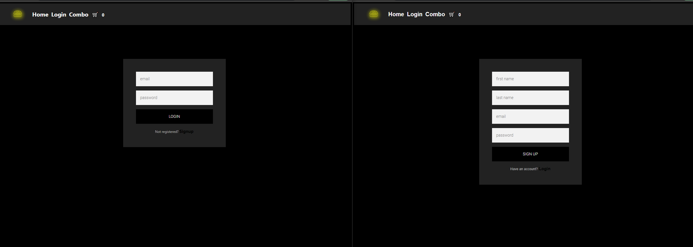
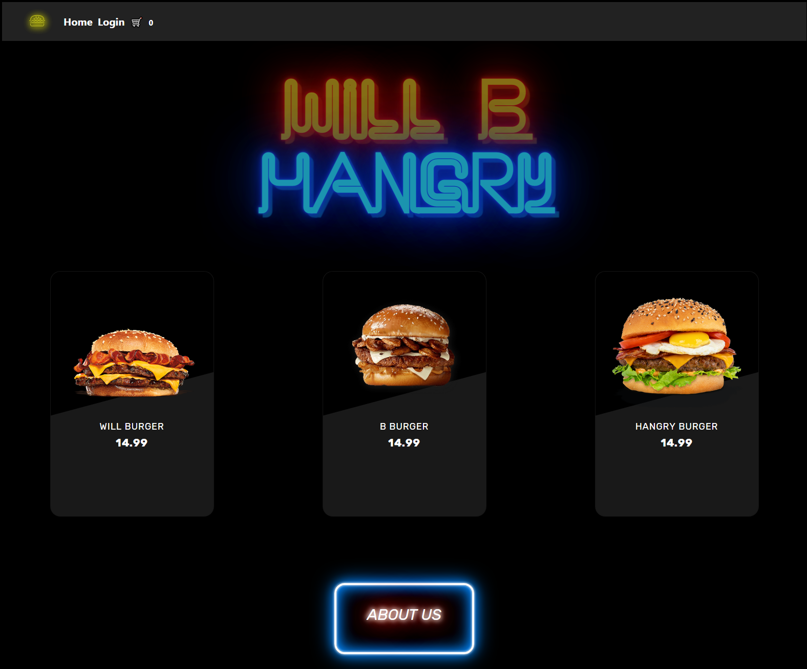

# Will B Hangry

## Description

Want to order from a restaurant, select the any item and modify as you wish. Check and have the option to add more items. Prepay for my order, and have a pick up or delivery option. Application is responsive and made using the MERN stack, graphql, Bootstrap, Redux, Stripe, and so much more! Our motivation was to create something that can help that late night cravings and can be more personalized and homey compared to other restaurants. It solves the issue of never knowing what to get with our smalling menue selection, allowing for an easier decision. Throughout this project, we learned about implementing liabraries, communication with a team, and provided better understanding of the MERN stack.

## Table of Contents (Optional)

- [Installation](#installation)
- [Usage](#usage)
- [Credits](#credits)
- [License](#license)

## Installation

No install required!

Just load up our site

site: https://will-b-hangry.herokuapp.com/

## Usage

Login or Signup

From the home page hover over items to add or customize

Make it a combo!

Last minuite changes to cart or checkout!

## Credits

Github: https://github.com/hannahhue/will-b-hangry

Contributers:

Will: https://github.com/ramosw1993

Ben: https://github.com/BenLiu104

Hannah: https://github.com/hannahhue

## License

MIT License

Permission is hereby granted, free of charge, to any person obtaining a copy of this software and associated documentation files (the "Software"), to deal in the Software without restriction, including without limitation the rights to use, copy, modify, merge, publish, distribute, sublicense, and/or sell copies of the Software, and to permit persons to whom the Software is furnished to do so, subject to the following conditions:

The above copyright notice and this permission notice shall be included in all copies or substantial portions of the Software.

THE SOFTWARE IS PROVIDED "AS IS", WITHOUT WARRANTY OF ANY KIND, EXPRESS OR IMPLIED, INCLUDING BUT NOT LIMITED TO THE WARRANTIES OF MERCHANTABILITY, FITNESS FOR A PARTICULAR PURPOSE AND NONINFRINGEMENT. IN NO EVENT SHALL THE AUTHORS OR COPYRIGHT HOLDERS BE LIABLE FOR ANY CLAIM, DAMAGES OR OTHER LIABILITY, WHETHER IN AN ACTION OF CONTRACT, TORT OR OTHERWISE, ARISING FROM, OUT OF OR IN CONNECTION WITH THE SOFTWARE OR THE USE OR OTHER DEALINGS IN THE SOFTWARE.
